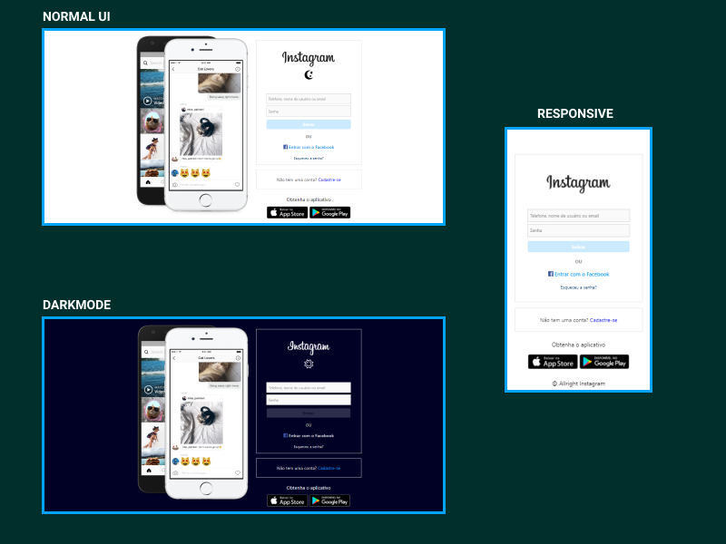

# DIO - REACT

Digital Innovatio One - Bootcamp React Web Developer

Bootcamp da [Digital Innovation One](https://digitalinnovation.one/) sobre conteúdo de React, mas abrangendo toda uma imensidão de áreas da Web, desde git até itens mais avançados como Redux na web.

## Lista de Projetos

* Projeto 1 - Instagram Clone UI
  * Tecnologias: HTML, CSS e JavaScript
  * Objetivo: Entender mais de Flex Layout
  * Situação: `Em desenvolvimento`
  * Como testar: Ao clonar/baixar o projeto, abra no navegador o arquivo index.html, contido em `projetos > p1-Instagram-clone`

## Histórico de lançamentos

* 0.0.9
  * ADD: Darktheme mode
  * MUDANÇA: Corrigida as imagens do `README`

* 0.0.8
  * MUDANÇA: Corrigido o `manifest-json` para seguir padrão do `README`

* 0.0.7
  * MUDANÇA: Tentativa FINAL de correção das imagens do `README`

* 0.0.6
  * MUDANÇA: Tentativa de correção do `README`

* 0.0.5
  * ADD: Responsividade, imagens neste readme
  * MUDANÇA: Corrigida a forma que o site se comporta em dispositivos mobiles.

* 0.0.4
  * ADD: `Manifest-json` create

* 0.0.3
  * ADD: LICENSE

* 0.0.2
  * ADD: Novas funcionalidades e novo projeto concluido, git init
  * MUDANÇA: `p1-Instagram-clone` concluido

* 0.0.1
  * ADD: Novo Readme (`Em desenvolvimento`), Projeto 1

## Meta

Douglas Walas – [Linkedin](https://www.linkedin.com/in/douglaswalas/)

Distribuído sob a licença MIT. Veja [LICENSE](LICENSE) para mais informações.

[https://github.com/DWRP](https://github.com/DWRP/)

## Contributing

1. Faça o _fork_ do projeto (<https://github.com/DWRP/DIO-REACT/fork>)
2. Crie uma _branch_ para sua modificação (`git checkout -b feature/fooBar`)
3. Faça o _commit_ (`git commit -am 'Add some fooBar'`)
4. _Push_ (`git push origin feature/fooBar`)
5. Crie um novo _Pull Request_
